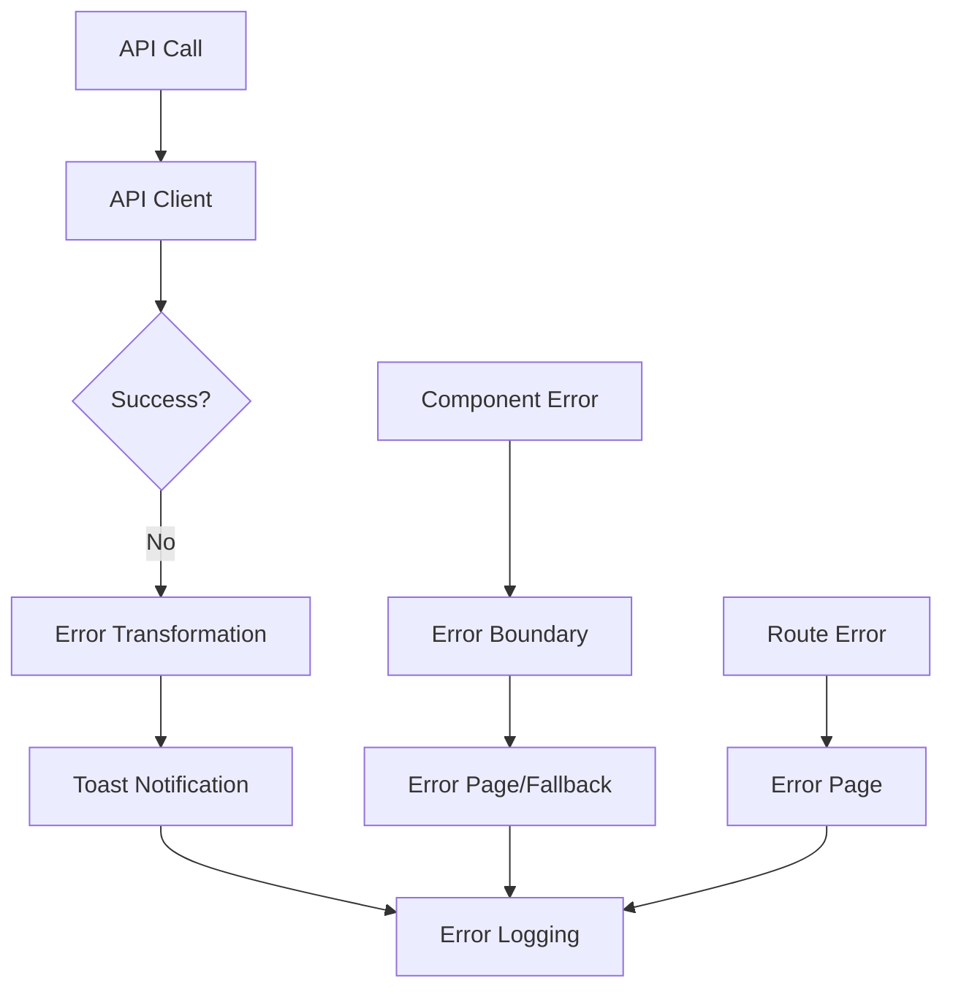

# Error Handling Guide

This guide covers the comprehensive error handling system implemented in Atlas UI. The system provides user-friendly error messages, robust error recovery, and proper error logging while maintaining excellent developer experience.

## Overview

Atlas UI implements a multi-layered error handling approach:

1. **API Client** - Centralized HTTP error handling with automatic retries
2. **Error Transformation** - Convert technical errors to user-friendly messages  
3. **Toast Notifications** - Non-intrusive error and success feedback
4. **Error Boundaries** - Catch React component errors gracefully
5. **Error Pages** - Specialized pages for different error scenarios
6. **Error Logging** - Production error tracking and debugging

## Architecture



## API Error Handling

### Centralized Service Layer

The service layer (`/services/api/`) provides automatic error handling for all API operations:

```typescript
import { accountsService, tenantsService } from '@/services/api';

// Basic usage with automatic error handling
const accounts = await accountsService.getAll();

// Create operation with validation
const newAccount = await accountsService.create({
  name: 'John Doe',
  email: 'john@example.com'
});

// With custom options and cancellation
const accountsPage = await accountsService.getAll({
  page: 1,
  pageSize: 20,
  signal: abortController.signal
});
```

**Features:**
- Automatic retry for transient errors (429, 500, 502, 503, 504)
- Exponential backoff with jitter
- Request timeouts with abort controller
- Request deduplication to prevent duplicate calls
- Tenant header injection
- Type-safe responses
- BaseService architecture with consistent CRUD operations
- Enhanced validation and error transformation
- Progress tracking for file uploads/downloads
- Response caching with configurable TTL

### Error Types

The system uses typed errors for better error handling:

```typescript
import { 
  ApiError, 
  NetworkError, 
  ValidationError,
  AuthenticationError,
  isApiError,
  isNetworkError 
} from '@/types/api/errors';

try {
  const accounts = await accountsService.getAll();
} catch (error) {
  if (isApiError(error)) {
    console.log(`API Error: ${error.status} - ${error.message}`);
  } else if (isNetworkError(error)) {
    console.log('Network connectivity issue');
  }
}
```

**Available Error Types:**
- `ApiError` - Base API error with status code
- `NetworkError` - Connection failures  
- `ValidationError` - Form validation errors with field details
- `AuthenticationError` - 401 unauthorized errors
- `AuthorizationError` - 403 forbidden errors
- `NotFoundError` - 404 resource not found
- `ServerError` - 5xx server errors
- `UnknownError` - Wrapped unknown errors

### Error Transformation

Convert technical errors to user-friendly messages:

```typescript
import { transformApiError } from '@/lib/api/errors';

try {
  await saveUserData(userData);
} catch (error) {
  const userMessage = transformApiError(error);
  // "Unable to save user data. Please try again."
  
  // With context for better messages
  const contextualMessage = transformApiError(error, {
    component: 'UserForm',
    action: 'save'
  });
  // "Failed to save user information. Please check your input and try again."
}
```

**Error Message Examples:**
- `400` → "Invalid request. Please check your input."
- `401` → "Please sign in to continue."
- `403` → "You don't have permission to perform this action."
- `404` → "The requested resource was not found."
- `429` → "Too many requests. Please try again later."
- `500` → "An unexpected error occurred. Please try again."

## Toast Notifications

### Basic Usage

```typescript
import { notify } from '@/lib/utils/toast';

// Success notification
notify.success('User created successfully!');

// Error notification with automatic transformation
try {
  await createUser(userData);
  notify.success('User created successfully!');
} catch (error) {
  notify.error(error); // Automatically transforms error
}

// Manual error message
notify.error('Something went wrong');

// Info and warning
notify.info('New features available!');
notify.warning('Your session will expire soon');
```

### Promise-Based Toasts

Handle loading states automatically:

```typescript
import { notify } from '@/lib/utils/toast';

// Shows loading → success/error toast
const promise = createUser(userData);
notify.promise(promise, {
  loading: 'Creating user...',
  success: 'User created successfully!',
  error: 'Failed to create user'
});

// With custom error transformation
notify.promise(promise, {
  loading: 'Saving changes...',
  success: (data) => `User ${data.name} created!`,
  error: (error) => transformApiError(error, { 
    component: 'UserForm', 
    action: 'create' 
  })
});
```

### Toast with Retry

Add retry functionality to error toasts:

```typescript
import { notify } from '@/lib/utils/toast';

const handleSave = async () => {
  try {
    await saveData();
    notify.success('Data saved successfully!');
  } catch (error) {
    notify.errorWithRetry(error, {
      onRetry: handleSave,
      maxRetries: 3,
      context: { component: 'DataForm', action: 'save' }
    });
  }
};
```

### Preset Operations

Common operation patterns:

```typescript
import { notify } from '@/lib/utils/toast';

// Preset for save operations
await notify.save(
  () => saveUserData(data),
  'Saving user...',
  'User saved successfully!'
);

// Preset for delete operations  
await notify.delete(
  () => deleteUser(userId),
  'Deleting user...',
  'User deleted successfully!'
);

// Preset for load operations
const data = await notify.load(
  () => fetchUserData(userId),
  'Loading user data...'
);
```

## Error Boundaries

### Basic Error Boundary

Wrap components to catch JavaScript errors:

```tsx
import { ErrorBoundary } from '@/components/common/ErrorBoundary';

function App() {
  return (
    <ErrorBoundary>
      <Header />
      <MainContent />
      <Footer />
    </ErrorBoundary>
  );
}
```

### Custom Fallback UI

```tsx
import { ErrorBoundary } from '@/components/common/ErrorBoundary';

<ErrorBoundary
  fallback={({ error, resetErrorBoundary }) => (
    <div className="p-6 text-center">
      <h2 className="text-xl font-semibold mb-2">Something went wrong</h2>
      <p className="text-muted-foreground mb-4">
        We encountered an unexpected error. Please try again.
      </p>
      <div className="space-x-2">
        <Button onClick={resetErrorBoundary}>
          Try Again
        </Button>
        <Button variant="outline" onClick={() => window.location.href = '/'}>
          Go Home
        </Button>
      </div>
    </div>
  )}
>
  <RiskyComponent />
</ErrorBoundary>
```

### Error Boundary Hook

Access error boundary functionality in components:

```tsx
import { useErrorBoundary } from '@/components/common/ErrorBoundary';

function DataComponent() {
  const { reportError } = useErrorBoundary();
  
  const handleAsyncError = async () => {
    try {
      await riskyAsyncOperation();
    } catch (error) {
      // Report to error boundary instead of throwing
      reportError(error);
    }
  };
  
  return (
    <button onClick={handleAsyncError}>
      Perform Risky Operation
    </button>
  );
}
```

## Error Pages

### Route Error Pages

Next.js automatically uses these for different error scenarios:

```tsx
// app/error.tsx - Route segment errors
'use client';

import { ErrorPage } from '@/components/common/ErrorPage';

export default function Error({
  error,
  reset,
}: {
  error: Error & { digest?: string };
  reset: () => void;
}) {
  return <ErrorPage error={error} onRetry={reset} />;
}
```

```tsx
// app/global-error.tsx - Global application errors
'use client';

import { ErrorPage } from '@/components/common/ErrorPage';

export default function GlobalError({
  error,
  reset,
}: {
  error: Error & { digest?: string };
  reset: () => void;
}) {
  return (
    <html>
      <body>
        <ErrorPage error={error} onRetry={reset} />
      </body>
    </html>
  );
}
```

```tsx
// app/not-found.tsx - 404 errors
import { ErrorPage } from '@/components/common/ErrorPage';

export default function NotFound() {
  return <ErrorPage.NotFound />;
}
```

### Specialized Error Pages

Pre-configured error pages for common scenarios:

```tsx
import { ErrorPage } from '@/components/common/ErrorPage';

// 400 Bad Request
<ErrorPage.BadRequest />

// 401 Unauthorized  
<ErrorPage.Unauthorized />

// 403 Forbidden
<ErrorPage.Forbidden />

// 404 Not Found
<ErrorPage.NotFound />

// 429 Too Many Requests
<ErrorPage.TooManyRequests />

// 500 Internal Server Error
<ErrorPage.InternalServerError />

// 502 Bad Gateway
<ErrorPage.BadGateway />

// 503 Service Unavailable
<ErrorPage.ServiceUnavailable />

// 504 Gateway Timeout
<ErrorPage.GatewayTimeout />

// Custom error page
<ErrorPage
  title="Payment Failed"
  message="Your payment could not be processed. Please try again or contact support."
  statusCode={402}
  actions={[
    { label: 'Try Again', onClick: retryPayment },
    { label: 'Contact Support', onClick: openSupport }
  ]}
/>
```

## Error Display Components

### Inline Error Display

For form errors and component-level errors:

```tsx
import { ErrorDisplay } from '@/components/common/ErrorDisplay';

function UserForm() {
  const [error, setError] = useState<Error | null>(null);
  
  return (
    <form>
      {error && (
        <ErrorDisplay 
          error={error} 
          retry={() => setError(null)}
          className="mb-4"
        />
      )}
      
      {/* form fields */}
    </form>
  );
}
```

### Form Field Errors

Integrated with react-hook-form:

```tsx
import { FormField } from '@/components/common/FormField';
import { useForm } from 'react-hook-form';

function UserForm() {
  const form = useForm<UserFormData>();
  
  return (
    <form>
      <FormField
        control={form.control}
        name="email"
        label="Email"
        type="email"
        placeholder="user@example.com"
        // Error automatically displayed from form validation
      />
    </form>
  );
}
```

## Error Logging

### Automatic Error Logging

Errors are automatically logged with context:

```typescript
// Errors are automatically logged by:
// - API client for HTTP errors
// - Error boundaries for component errors  
// - Error pages for route errors
// - Toast notifications for user-triggered errors

// Manual error logging
import { errorLogger } from '@/services/errorLogger';

try {
  await riskyOperation();
} catch (error) {
  await errorLogger.logError(error, {
    component: 'DataProcessor',
    action: 'processData',
    userId: user.id,
    metadata: { dataSize: data.length }
  });
}
```

### Error Context

Errors are logged with comprehensive context:

```typescript
interface ErrorContext {
  component?: string;        // Component name
  action?: string;           // User action
  userId?: string;           // User identifier
  sessionId?: string;        // Session identifier
  url?: string;              // Current URL
  userAgent?: string;        // Browser information
  buildVersion?: string;     // Application version
  metadata?: Record<string, any>; // Additional context
}
```

### Development Logging

In development, errors are logged to console with detailed information:

```typescript
// Console output example:
// 🚨 [Atlas UI] Error Report
// ├─ Severity: HIGH
// ├─ Component: UserForm
// ├─ Action: save
// ├─ Message: Failed to save user data
// ├─ Context: { userId: '123', formData: {...} }
// └─ Stack: Error: Network request failed...
```

## Usage Patterns

### API Integration Pattern

```typescript
'use client';

import { useState } from 'react';
import { accountsService } from '@/services/api';
import { notify } from '@/lib/utils/toast';
import { LoadingOverlay } from '@/components/common/LoadingOverlay';
import { ErrorDisplay } from '@/components/common/ErrorDisplay';

function AccountManagement() {
  const [accounts, setAccounts] = useState<Account[]>([]);
  const [loading, setLoading] = useState(false);
  const [error, setError] = useState<Error | null>(null);
  
  const loadAccounts = async () => {
    setLoading(true);
    setError(null);
    
    try {
      const data = await accountsService.getAll();
      setAccounts(data);
    } catch (err) {
      setError(err as Error);
      notify.error(err);
    } finally {
      setLoading(false);
    }
  };
  
  const deleteAccount = async (accountId: string) => {
    try {
      await notify.delete(
        () => accountsService.delete(accountId),
        'Deleting account...',
        'Account deleted successfully!'
      );
      
      // Refresh list
      await loadAccounts();
    } catch (err) {
      // Error automatically handled by notify.delete
    }
  };
  
  return (
    <LoadingOverlay loading={loading}>
      <div className="space-y-4">
        <div className="flex justify-between items-center">
          <h1>Accounts</h1>
          <Button onClick={loadAccounts}>Refresh</Button>
        </div>
        
        {error && (
          <ErrorDisplay 
            error={error} 
            retry={loadAccounts}
            title="Failed to load accounts"
          />
        )}
        
        <AccountTable accounts={accounts} onDelete={deleteAccount} />
      </div>
    </LoadingOverlay>
  );
}
```

### Form Validation Pattern

```typescript
import { useForm } from 'react-hook-form';
import { zodResolver } from '@hookform/resolvers/zod';
import { z } from 'zod';
import { FormField } from '@/components/common/FormField';
import { notify } from '@/lib/utils/toast';
import { accountsService } from '@/services/api';

const userSchema = z.object({
  name: z.string().min(2, 'Name must be at least 2 characters'),
  email: z.string().email('Invalid email address'),
  age: z.number().min(1, 'Age must be positive').max(120, 'Invalid age'),
});

type UserFormData = z.infer<typeof userSchema>;

function CreateAccountForm() {
  const form = useForm<UserFormData>({
    resolver: zodResolver(userSchema),
  });
  
  const onSubmit = async (data: UserFormData) => {
    try {
      await notify.save(
        () => accountsService.create(data),
        'Creating account...',
        'Account created successfully!'
      );
      
      form.reset();
    } catch (error) {
      // Handle validation errors specifically
      if (error instanceof ValidationError) {
        error.errors.forEach((fieldError) => {
          form.setError(fieldError.field as keyof UserFormData, {
            message: fieldError.message
          });
        });
      }
      // Other errors handled by notify.save
    }
  };
  
  return (
    <form onSubmit={form.handleSubmit(onSubmit)} className="space-y-4">
      <FormField
        control={form.control}
        name="name"
        label="Name"
        placeholder="Enter name"
      />
      
      <FormField
        control={form.control}
        name="email"
        label="Email"
        type="email"
        placeholder="user@example.com"
      />
      
      <FormField
        control={form.control}
        name="age"
        label="Age"
        type="number"
        placeholder="Enter age"
      />
      
      <Button type="submit" disabled={form.formState.isSubmitting}>
        {form.formState.isSubmitting && <LoadingSpinner size="sm" />}
        Create Account
      </Button>
    </form>
  );
}
```

### Data Table Pattern

```tsx
import { DataTableWrapper } from '@/components/common/DataTableWrapper';
import { ErrorBoundary } from '@/components/common/ErrorBoundary';

function AccountsTable() {
  const { data, isLoading, error, refetch } = useQuery({
    queryKey: ['accounts'],
    queryFn: () => accountsService.getAll(),
    retry: (failureCount, error) => {
      // Don't retry on 4xx errors except 429
      if (error instanceof ApiError && error.status >= 400 && error.status < 500 && error.status !== 429) {
        return false;
      }
      return failureCount < 3;
    }
  });
  
  return (
    <ErrorBoundary>
      <DataTableWrapper
        columns={accountColumns}
        data={data || []}
        loading={isLoading}
        error={error}
        onRefresh={refetch}
        emptyState={{
          title: "No accounts found",
          description: "Create your first account to get started.",
          action: {
            label: "Add Account",
            onClick: () => router.push('/accounts/new')
          }
        }}
      />
    </ErrorBoundary>
  );
}
```

## Best Practices

### 1. Error Handling Hierarchy

Follow this hierarchy for error handling:

1. **Try to prevent errors** - Input validation, loading states
2. **Handle errors gracefully** - User-friendly messages, retry options
3. **Log errors for debugging** - Comprehensive context, sanitized data
4. **Provide recovery options** - Retry, navigation, support contact

### 2. Error Message Guidelines

- **Be specific but not technical** - "Failed to save user data" not "HTTP 500 Internal Server Error"
- **Provide actionable guidance** - "Please check your input and try again"
- **Avoid blame language** - "Unable to process request" not "You entered invalid data"
- **Include recovery options** - Retry buttons, navigation links, support contact

### 3. Error Context

Always provide context when logging errors:

```typescript
// Good
errorLogger.logError(error, {
  component: 'UserForm',
  action: 'save',
  userId: user.id,
  formData: sanitizedFormData
});

// Bad
errorLogger.logError(error);
```

### 4. Error Boundaries Placement

Place error boundaries at strategic levels:

```tsx
// App level - catch critical errors
<ErrorBoundary fallback={<AppErrorPage />}>
  <App />
</ErrorBoundary>

// Feature level - catch feature-specific errors
<ErrorBoundary fallback={<FeatureErrorPage />}>
  <UserManagement />
</ErrorBoundary>

// Component level - catch component-specific errors
<ErrorBoundary fallback={<ComponentError />}>
  <ComplexDataVisualization />
</ErrorBoundary>
```

### 5. Progressive Error Enhancement

Start with basic error handling and enhance progressively:

```typescript
// Basic: Show generic error message
catch (error) {
  setError('Something went wrong');
}

// Better: Show specific error message
catch (error) {
  setError(transformApiError(error));
}

// Best: Show specific message with retry and logging
catch (error) {
  const message = transformApiError(error, { component: 'UserForm', action: 'save' });
  setError(message);
  errorLogger.logError(error, { component: 'UserForm', action: 'save', userId });
}
```

### 6. Testing Error Scenarios

Always test error scenarios:

```typescript
// Test API errors
it('handles API errors gracefully', async () => {
  mockApiClient.get.mockRejectedValue(new ApiError(500, 'Server Error'));
  
  render(<UserList />);
  
  await waitFor(() => {
    expect(screen.getByText(/unexpected error occurred/)).toBeInTheDocument();
    expect(screen.getByText(/try again/)).toBeInTheDocument();
  });
});

// Test error boundary
it('error boundary catches component errors', () => {
  const ThrowError = () => {
    throw new Error('Test error');
  };
  
  render(
    <ErrorBoundary>
      <ThrowError />
    </ErrorBoundary>
  );
  
  expect(screen.getByText(/something went wrong/)).toBeInTheDocument();
});
```

## Migration Guide

### From Manual Error Handling

```typescript
// Before: Manual error handling
const [accounts, setAccounts] = useState([]);
const [loading, setLoading] = useState(false);
const [error, setError] = useState('');

const loadAccounts = async () => {
  setLoading(true);
  setError('');
  
  try {
    const response = await fetch('/api/accounts');
    if (!response.ok) {
      throw new Error('Failed to load accounts');
    }
    const data = await response.json();
    setAccounts(data);
  } catch (err) {
    setError(err.message);
    console.error('Error loading accounts:', err);
  } finally {
    setLoading(false);
  }
};

// After: Using centralized service layer
const [accounts, setAccounts] = useState([]);
const [loading, setLoading] = useState(false);
const [error, setError] = useState<Error | null>(null);

const loadAccounts = async () => {
  setLoading(true);
  setError(null);
  
  try {
    const data = await accountsService.getAll();
    setAccounts(data);
    notify.success('Accounts loaded successfully');
  } catch (err) {
    setError(err as Error);
    notify.error(err); // Automatic error transformation and logging
  } finally {
    setLoading(false);
  }
};
```

### Updating Existing Components

1. **Replace manual fetch with service layer** - Use services from `/services/api`
2. **Replace custom error states with ErrorDisplay component**  
3. **Add toast notifications for user feedback**
4. **Wrap with ErrorBoundary for unexpected errors**
5. **Use FormField components for form validation errors**
6. **Leverage BaseService features** - Batch operations, request cancellation, caching

## Configuration

### Environment Variables

```env
# Error logging configuration
NEXT_PUBLIC_ERROR_LOGGING_ENABLED=true
NEXT_PUBLIC_ERROR_LOGGING_ENDPOINT=https://api.example.com/errors
NEXT_PUBLIC_BUILD_VERSION=1.0.0

# API configuration
NEXT_PUBLIC_API_BASE_URL=https://api.example.com
NEXT_PUBLIC_API_TIMEOUT=30000
NEXT_PUBLIC_API_RETRY_COUNT=3
```

### Global Configuration

```typescript
// lib/config/errorHandling.ts
export const errorConfig = {
  logging: {
    enabled: process.env.NEXT_PUBLIC_ERROR_LOGGING_ENABLED === 'true',
    endpoint: process.env.NEXT_PUBLIC_ERROR_LOGGING_ENDPOINT,
    maxRetries: 3,
    rateLimit: {
      maxReports: 10,
      windowMs: 60000, // 1 minute
    }
  },
  api: {
    baseUrl: process.env.NEXT_PUBLIC_API_BASE_URL,
    timeout: parseInt(process.env.NEXT_PUBLIC_API_TIMEOUT || '30000'),
    retryCount: parseInt(process.env.NEXT_PUBLIC_API_RETRY_COUNT || '3'),
  },
  toasts: {
    duration: 5000,
    position: 'bottom-right' as const,
  }
};
```

This comprehensive error handling system ensures excellent user experience while providing developers with the tools needed to debug and resolve issues quickly. The system is designed to be robust in production while providing detailed debugging information during development.