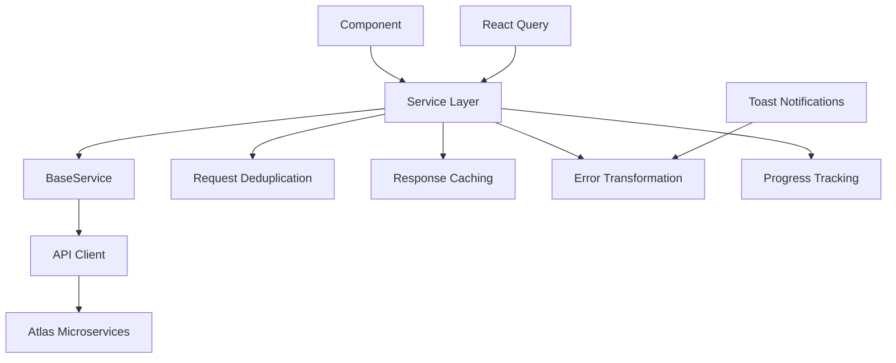

# Service Layer Architecture Guide

This guide covers the centralized API service layer architecture implemented in Atlas UI. The service layer provides a consistent, type-safe, and feature-rich abstraction over API calls, replacing scattered API logic with organized, maintainable services.

## Overview

The service layer architecture provides:

- **Centralized API Logic**: All API calls organized in `/services/api/`
- **BaseService Architecture**: Common functionality shared across all services
- **Enhanced Features**: Request cancellation, deduplication, caching, retry logic
- **Type Safety**: Full TypeScript support with comprehensive types
- **Error Handling**: Centralized error transformation and user-friendly messages
- **React Query Integration**: Optimized caching and state management

## Architecture



## Service Structure

### Available Services

```
services/api/
├── base.service.ts          # Base service class with common functionality
├── tenants.service.ts       # Tenant management and configuration
├── accounts.service.ts      # Account operations and queries
├── characters.service.ts    # Character management
├── inventory.service.ts     # Inventory and compartment operations
├── maps.service.ts          # Map data and management
├── guilds.service.ts        # Guild operations
├── npcs.service.ts          # NPC shop and commodity management
├── conversations.service.ts # NPC conversation management
├── templates.service.ts     # Template management
└── index.ts                 # Service exports
```

### BaseService Features

All services extend `BaseService` which provides:

```typescript
class BaseService<T> {
  // Core CRUD operations
  async getAll(options?: QueryOptions): Promise<T[]>
  async getById(id: string, options?: ServiceOptions): Promise<T>
  async create(data: Partial<T>, options?: ServiceOptions): Promise<T>
  async update(id: string, data: Partial<T>, options?: ServiceOptions): Promise<T>
  async delete(id: string, options?: ServiceOptions): Promise<void>
  
  // Batch operations
  async batchCreate(items: Partial<T>[], options?: BatchOptions): Promise<BatchResult<T>>
  async batchUpdate(updates: Array<{id: string, data: Partial<T>}>, options?: BatchOptions): Promise<BatchResult<T>>
  async batchDelete(ids: string[], options?: BatchOptions): Promise<BatchResult<void>>
  
  // Advanced features
  async exists(id: string): Promise<boolean>
  async count(filters?: Record<string, any>): Promise<number>
  
  // Request management
  cancelAllRequests(): void
  clearCache(): void
}
```

## Usage Examples

### Basic CRUD Operations

```typescript
import { tenantsService, accountsService } from '@/services/api';

// Get all items
const tenants = await tenantsService.getAll();
const accounts = await accountsService.getAll();

// Get by ID
const tenant = await tenantsService.getById('tenant-123');

// Create new item
const newAccount = await accountsService.create({
  name: 'New Account',
  email: 'user@example.com'
});

// Update existing item
const updatedTenant = await tenantsService.update('tenant-123', {
  name: 'Updated Name'
});

// Delete item
await accountsService.delete('account-456');
```

### Advanced Operations

```typescript
// Paginated queries
const accountsPage = await accountsService.getAll({
  page: 1,
  pageSize: 20,
  filters: { status: 'active' },
  sort: { field: 'createdAt', direction: 'desc' }
});

// Request cancellation
const controller = new AbortController();
const accounts = await accountsService.getAll({
  signal: controller.signal
});
// Cancel if needed
controller.abort();

// Batch operations
const results = await accountsService.batchCreate([
  { name: 'Account 1', email: 'user1@example.com' },
  { name: 'Account 2', email: 'user2@example.com' },
  { name: 'Account 3', email: 'user3@example.com' }
]);

console.log(`Created ${results.successful.length} accounts`);
if (results.failed.length > 0) {
  console.log('Failed items:', results.failed);
}
```

### Service-Specific Methods

Each service provides domain-specific methods beyond basic CRUD:

```typescript
// Tenants service
const tenantConfig = await tenantsService.getConfiguration('tenant-123');
await tenantsService.updateConfiguration('tenant-123', { theme: 'dark' });

// Characters service  
const charactersByAccount = await charactersService.getByAccountId('account-123');
await charactersService.updateLevel('char-456', 50);

// NPCs service
const shop = await npcsService.getShop('npc-789');
const commodities = await npcsService.getCommodities('npc-789');
await npcsService.updateCommodity('npc-789', 'commodity-123', { price: 1000 });

// Inventory service
const inventory = await inventoryService.getByCharacterId('char-123');
const compartment = await inventoryService.getCompartment('char-123', 'EQUIPPED');
await inventoryService.moveItem('char-123', 'item-456', 'EQUIP', 1);
```

## React Query Integration

Services work seamlessly with React Query for optimized caching:

```typescript
import { useQuery, useMutation, useQueryClient } from '@tanstack/react-query';
import { tenantsService } from '@/services/api';

// Query hook
export function useTenants() {
  return useQuery({
    queryKey: ['tenants'],
    queryFn: () => tenantsService.getAll(),
    staleTime: 5 * 60 * 1000, // 5 minutes
  });
}

// Mutation hook with cache invalidation
export function useCreateTenant() {
  const queryClient = useQueryClient();
  
  return useMutation({
    mutationFn: (data: CreateTenantData) => tenantsService.create(data),
    onSuccess: () => {
      queryClient.invalidateQueries({ queryKey: ['tenants'] });
    },
  });
}

// In component
function TenantsPage() {
  const { data: tenants, isLoading, error } = useTenants();
  const createTenant = useCreateTenant();
  
  const handleCreate = async (formData: CreateTenantData) => {
    try {
      await createTenant.mutateAsync(formData);
      notify.success('Tenant created successfully!');
    } catch (error) {
      notify.error(error);
    }
  };
  
  if (isLoading) return <LoadingSpinner />;
  if (error) return <ErrorDisplay error={error} />;
  
  return <TenantsTable tenants={tenants} onCreate={handleCreate} />;
}
```

## Error Handling

Services provide comprehensive error handling:

```typescript
try {
  const account = await accountsService.getById('account-123');
} catch (error) {
  if (error instanceof ValidationError) {
    // Handle validation errors
    error.errors.forEach(fieldError => {
      console.log(`${fieldError.field}: ${fieldError.message}`);
    });
  } else if (error instanceof ApiError) {
    // Handle API errors
    console.log(`API Error ${error.status}: ${error.message}`);
  } else {
    // Handle unexpected errors
    console.log('Unexpected error:', error);
  }
}
```

### Automatic Error Transformation

Services automatically transform technical errors into user-friendly messages:

```typescript
// Technical error: "HTTP 500 Internal Server Error"
// Transformed to: "Unable to save account data. Please try again."

// Technical error: "Network request failed"  
// Transformed to: "Connection failed. Please check your internet connection."

// Validation error with field details
// Transformed to: "Please check the following fields: Name is required, Email must be valid"
```

## Request Management

### Request Deduplication

Duplicate requests are automatically deduplicated:

```typescript
// These three calls will result in only one HTTP request
const promise1 = tenantsService.getById('tenant-123');
const promise2 = tenantsService.getById('tenant-123');
const promise3 = tenantsService.getById('tenant-123');

// All promises resolve with the same result
const [result1, result2, result3] = await Promise.all([promise1, promise2, promise3]);
```

### Request Cancellation

All service methods support request cancellation:

```typescript
const controller = new AbortController();

// Start a long-running request
const accountsPromise = accountsService.getAll({
  signal: controller.signal
});

// Cancel if user navigates away
useEffect(() => {
  return () => controller.abort();
}, []);

// Or cancel all pending requests for a service
accountsService.cancelAllRequests();
```

### Progress Tracking

Track progress for file uploads and large operations:

```typescript
const result = await inventoryService.importItems(file, {
  onProgress: (progress) => {
    console.log(`Upload progress: ${progress.percentage}%`);
    setProgress(progress.percentage);
  }
});
```

## Caching Strategy

Services implement intelligent caching:

```typescript
// Configure cache TTL per service
const tenants = await tenantsService.getAll({
  cacheTTL: 10 * 60 * 1000 // Cache for 10 minutes
});

// Force fresh data (bypass cache)
const freshTenants = await tenantsService.getAll({
  fresh: true
});

// Clear cache manually
tenantsService.clearCache();
```

## Type Safety

Services provide comprehensive TypeScript support:

```typescript
// Service methods are fully typed
const tenant: Tenant = await tenantsService.getById('tenant-123');

// Create operations validate input types
const newTenant = await tenantsService.create({
  name: 'New Tenant', // ✓ Valid
  email: 'tenant@example.com', // ✓ Valid
  invalidField: 'value' // ✗ TypeScript error
});

// Query options are typed
const tenants = await tenantsService.getAll({
  page: 1, // ✓ number
  pageSize: 'invalid', // ✗ TypeScript error - should be number
  filters: {
    status: 'active' // ✓ Valid filter
  }
});
```

## Testing Services

Services are designed to be easily testable:

```typescript
import { tenantsService } from '@/services/api/tenants.service';
import { mockApiClient } from '@/lib/api/__mocks__/client';

// Mock the API client
jest.mock('@/lib/api/client');

describe('TenantsService', () => {
  beforeEach(() => {
    jest.clearAllMocks();
  });
  
  it('should fetch all tenants', async () => {
    const mockTenants = [
      { id: '1', name: 'Tenant 1' },
      { id: '2', name: 'Tenant 2' }
    ];
    
    mockApiClient.get.mockResolvedValue({ data: mockTenants });
    
    const result = await tenantsService.getAll();
    
    expect(mockApiClient.get).toHaveBeenCalledWith('/tenants');
    expect(result).toEqual(mockTenants);
  });
  
  it('should handle errors gracefully', async () => {
    mockApiClient.get.mockRejectedValue(new Error('Network error'));
    
    await expect(tenantsService.getAll()).rejects.toThrow('Network error');
  });
});
```

## Migration Guide

### From Direct API Calls

```typescript
// Before: Direct API calls
const response = await fetch('/api/tenants');
const tenants = await response.json();

// After: Service layer
const tenants = await tenantsService.getAll();
```

### From lib/api Files

```typescript
// Before: lib/api/tenants.ts
import { getTenants, createTenant } from '@/lib/api/tenants';

const tenants = await getTenants();
const newTenant = await createTenant(data);

// After: Service layer
import { tenantsService } from '@/services/api';

const tenants = await tenantsService.getAll();
const newTenant = await tenantsService.create(data);
```

### Component Updates

```typescript
// Before: Manual state management
const [tenants, setTenants] = useState([]);
const [loading, setLoading] = useState(false);

const loadTenants = async () => {
  setLoading(true);
  try {
    const data = await getTenants();
    setTenants(data);
  } catch (error) {
    console.error(error);
  } finally {
    setLoading(false);
  }
};

// After: React Query integration
const { data: tenants, isLoading } = useQuery({
  queryKey: ['tenants'],
  queryFn: () => tenantsService.getAll()
});
```

## Best Practices

### 1. Use Service Methods Over Direct API Calls

```typescript
// ✅ Good
const tenants = await tenantsService.getAll();

// ❌ Bad
const response = await fetch('/api/tenants');
const tenants = await response.json();
```

### 2. Leverage BaseService Features

```typescript
// ✅ Good - Use batch operations for multiple items
const results = await accountsService.batchCreate(accountsData);

// ❌ Bad - Multiple individual calls
const accounts = await Promise.all(
  accountsData.map(data => accountsService.create(data))
);
```

### 3. Handle Errors Appropriately

```typescript
// ✅ Good - Use toast notifications for user feedback
try {
  await tenantsService.create(tenantData);
  notify.success('Tenant created successfully!');
} catch (error) {
  notify.error(error); // Automatic error transformation
}

// ❌ Bad - Silent failures
try {
  await tenantsService.create(tenantData);
} catch (error) {
  console.log(error); // User sees nothing
}
```

### 4. Use React Query for Caching

```typescript
// ✅ Good - Leverage React Query caching
const { data } = useQuery({
  queryKey: ['tenants'],
  queryFn: () => tenantsService.getAll()
});

// ❌ Bad - Manual state management
const [tenants, setTenants] = useState([]);
useEffect(() => {
  tenantsService.getAll().then(setTenants);
}, []);
```

### 5. Cancel Requests When Appropriate

```typescript
// ✅ Good - Cancel requests on unmount
useEffect(() => {
  const controller = new AbortController();
  
  loadData({ signal: controller.signal });
  
  return () => controller.abort();
}, []);

// ❌ Bad - Potential memory leaks
useEffect(() => {
  loadData(); // Request continues even if component unmounts
}, []);
```

## Configuration

Services can be configured globally:

```typescript
// lib/config/services.ts
export const serviceConfig = {
  baseURL: process.env.NEXT_PUBLIC_API_URL,
  timeout: 30000,
  retryCount: 3,
  cacheTTL: 5 * 60 * 1000, // 5 minutes
  deduplication: {
    enabled: true,
    ttl: 1000 // 1 second
  },
  progressTracking: {
    enabled: true,
    throttle: 100 // Update every 100ms
  }
};
```

The service layer architecture provides a robust, type-safe, and feature-rich foundation for all API operations in Atlas UI. By centralizing API logic and providing consistent patterns, it significantly improves code maintainability, developer experience, and application reliability.